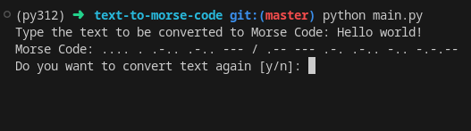

# Text to Morse Code Converter

A text-based Python program to convert user input into Morse Code.



## Table of Contents

- [Introduction](#introduction)
- [Requirements](#requirements)
- [Installation](#installation)
- [Usage](#usage)
- [Contributing](#contributing)
- [License](#license)

## Introduction

- The dictionary of supported characters is located in `data.py` file.
- Each morse "character" is seperated from the next one with a space.
- Morse code words are seperated with a slash "/" character.

## Requirements

To run this program, you need to have the following installed:

- Python 3.x

## Installation

1. Clone this repository to your local machine:

   ```bash
   git clone https://github.com/alexkanavos/text-to-morse-code.git
   ```

2. Navigate to the project directory:

   ```bash
   cd text-to-morse-code
   ```

## Usage

To start the program, run the following command:

```bash
python3 main.py
```

## Contributing

Contributions are welcome! If you'd like to contribute to this project, please follow these steps:

1. Fork the repository
2. Create your feature branch (`git checkout -b feature/YourFeature`)
3. Commit your changes (`git commit -am 'Add some feature'`)
4. Push to the branch (`git push origin feature/YourFeature`)
5. Create a new Pull Request

## License

This project is licensed under the MIT License - see the [LICENSE](LICENSE) file for details.
