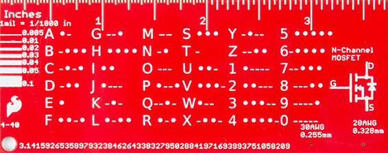

# Text to Morse Code Converter

A text-based Python program to convert user input into Morse Code.

- The dictionary of supported characters is located in `data.py` file.
- Each morse "character" is seperated from the next one with a space.
- Morse code words are seperated with a slash "/" character.
